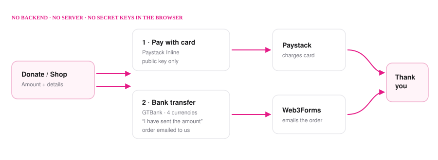

<div align="center">



<br>

<a href="#-quick-start"></a>
<a href="#-payments"></a>
<a href="#-deploying"></a>
<a href="#-tests"></a>


<br><br>

### **Saving lives. Restoring dignity. Building hope.**

The website for **Smart Response Youth Foundation** — the NGO behind the
**112 Smart Response App** and the **Save Her Dignity Campaign**.

<sub>Registered in Nigeria · CAC/IT/8435264</sub>

</div>

---

## ✦ What this site does

|  | Feature | Detail |
|:-:|---|---|
| 💗 | **Donate** | One-off giving at any amount, plus weekly / monthly / yearly recurring |
| 🏦 | **4-currency transfer** | GTBank NGN · USD · EUR · GBP, one-tap copy |
| ⌚ | **Shop** | Safety watches & sanitary packs, with automatic bulk pricing |
| 📖 | **Blog** | Three full articles at real URLs, plus testimonials |
| 🙋 | **Volunteer** | Application form that actually reaches the inbox |
| 📱 | **App launch** | Flyer, install QR code, event details |
| ⚖️ | **Legal** | Terms & Conditions, Privacy Policy |

---

## ⚡ Quick start

```bash
npm install
npm start          # → http://localhost:4200
```

```bash
npm run build                  # production build
npx ng test --watch=false      # 26 tests
```

> **Everything configurable lives in one file:**
> [`src/app/core/site-config.ts`](src/app/core/site-config.ts)
> — bank details, links, contact, Paystack keys, launch info.

---

## 💳 Payments

<div align="center">

</div>

There is **no backend and no server to run.** Card payments use Paystack
Inline with the *public* key, which is safe to ship in the browser.

### Two keys to paste

```ts
// src/app/core/site-config.ts
paystack: {
  publicKey: 'pk_test_xxxxx',   // Developers → API Keys
```

> [!WARNING]
> **Never put the Paystack secret key in this project.** Everything here
> ships to the visitor's browser. Only the `pk_` key belongs in the code.

### Recurring giving

A Paystack Plan carries a **fixed amount**, so recurring giving is offered as
tiers. Create a Plan per amount under **Recurring → Plans**, then paste each
`PLN_` code beside its amount:

| Frequency | Amounts |
|---|---|
| Weekly | ₦1,000 · ₦2,500 · ₦5,000 |
| Monthly | ₦2,000 · ₦5,000 · ₦10,000 · ₦25,000 |
| Yearly | ₦25,000 · ₦50,000 · ₦100,000 |

Tiers with an empty code are **hidden automatically**, so you can launch with
only the plans you have created. One-off giving needs no plans at all.

> [!NOTE]
> Paystack settles in **NGN** unless multicurrency is enabled, so the USD, EUR
> and GBP accounts are **transfer-only** for now.

---

## 📬 Forms

No backend, but nothing is lost. Submissions go through
[Web3Forms](https://web3forms.com) straight to the foundation's inbox:

```ts
forms: { web3formsKey: 'your-access-key' }
```

Without a key, forms **fall back to opening the visitor's mail client** with
the message pre-filled. This covers the contact form, volunteer applications,
and bank-transfer orders — a transfer alone would never tell you *what* was
ordered or *where* to deliver it.

---

## 🖼 Images

Drop files into `public/images/` using these exact names; missing files fall
back to a placeholder rather than a broken icon.

```
public/images/
├── logo.jpeg
├── launch-flyer.jpg
├── qr-install.png              ← extracted from the launch PDF
├── team/
│   ├── victoria.jpg
│   ├── joyce.jpg
│   └── damilare.jpg            ← still needed
└── products/
    ├── smart-watch.jpg
    └── smart-watch-colours.jpg
```

---

## 🗂 Structure

```
src/app/
├── core/                 site-config · paystack · form-delivery
├── data/                 blog-posts · products · trustees
├── components/           navbar · footer
└── pages/                home about services blog blog-post donate
                          shop volunteer contact thank-you legal
```

Content lives in `data/`, not in templates — so adding a blog post or a
product is a data edit, never a markup edit.

---

## 🚀 Deploying

`vercel.json` is ready:

| Setting | Value |
|---|---|
| Build command | `npm run build` |
| Output directory | `dist/smartresponse-ngo/browser` |
| Rewrites | all routes → `index.html` |

> [!IMPORTANT]
> **That rewrite is not optional.** Without it only the home page works —
> opening `/donate` directly, or refreshing on `/blog/why-dignity-matters`,
> returns a 404. Angular routes in the browser, so the server must hand every
> path to `index.html`.

Then add the domain under **Vercel → Settings → Domains** and point your
registrar's DNS at Vercel.

---

## ✅ Tests

```bash
npx ng test --watch=false
```

Guarding the parts where a mistake costs real money:

- bulk pricing switches at exactly 100 units, never below
- quantity can never drop below 1
- a recurring gift is refused unless a matching plan code exists
- a custom amount is ignored once a recurring frequency is chosen
- the thank-you page receives the **real** total, not zero
- nothing is sent when delivery details are incomplete

---

## 📌 Still to come

- [ ] Paystack public key + plan codes
- [ ] Web3Forms access key
- [ ] Phone number (`+234 XXX XXX XXXX`)
- [ ] Web app URL the install QR points to
- [ ] Donald — photo and short bio
- [ ] Legal review of Terms & Privacy

See **[SETUP.md](SETUP.md)** for the full checklist.

---

<div align="center">

**112 Smart Response App** — Connecting People. Connecting Response. Protecting Lives.

<sub>One App. One Community. One Response.</sub>

</div>
